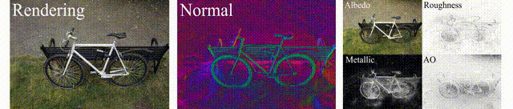
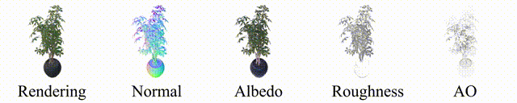

# <p align="center"> GS-IR: 3D Gaussian Splatting for Inverse Rendering </p>

#####  <p align="center"> [Zhihao Liang](https://lzhnb.github.io/), [Qi Zhang](https://qzhang-cv.github.io/), [Ying Feng](https://scholar.google.com.hk/citations?user=PhkrqioAAAAJ&hl=zh-CN), [Ying Shan](https://scholar.google.com/citations?user=4oXBp9UAAAAJ&hl=zh-CN), [Kui Jia](http://kuijia.site/)</p>

#### <p align="center">[Project Page](https://lzhnb.github.io/project-pages/gs-ir.html) | [ArXiv](https://arxiv.org/abs/2311.16473) | [Paper](https://arxiv.org/abs/2311.16473)</p>

## Introduction
We present GS-IR that models a scene as a set of 3D Gaussians to achieve physically-based rendering and state-ofthe-art decomposition results for both objects and scenes.

<p align="center">
  
  
  
</p>

<!-- <p align="center"> All Code will be released soon... 🏗️ 🚧 🔨</p> -->

> Welcome to our new work [Analytic-Splatting](https://github.com/lzhnb/Analytic-Splatting). We achieve anti-aliasing and excellent detail fidelity through analytical integral approximation.

## Installation
create the basic environment
```sh
conda env create --file environment.yml
conda activate gsir

pip install kornia
```

install some extensions
```sh
cd gs-ir && python setup.py develop && cd ..

cd submodules
git clone https://github.com/NVlabs/nvdiffrast
pip install ./nvdiffrast

pip install ./simple-knn
pip install ./diff-gaussian-rasterization # or cd ./diff-gaussian-rasterization && python setup.py develop && cd ../..
```

## Dataset
We evaluate our method on [TensoIR-Synthetic](https://zenodo.org/records/7880113#.ZE68FHZBz18) and [Mip-NeRF 360](https://jonbarron.info/mipnerf360/) datasets. And please visit [here](https://drive.google.com/file/d/10WLc4zk2idf4xGb6nPL43OXTTHvAXSR3/view?usp=share_link) for the environment maps.
Please refer to the [TensoIR](https://github.com/Haian-Jin/TensoIR?tab=readme-ov-file) for more details about **TensoIR-Synthetic** and **Environment map**.

## Running
### TensoIR-Synthetic
Take the `lego` case as an example.

**Stage1 (Initial Stage)**
```sh
python train.py \
-m outputs/lego/ \
-s datasets/TensoIR/lego/ \
--iterations 30000 \
--eval
```

**Baking**
```sh
python baking.py \
-m outputs/lego/ \
--checkpoint outputs/lego/chkpnt30000.pth \
--bound 1.5 \
--occlu_res 128 \
--occlusion 0.25
```

**Stage2 (Decomposition Stage)**
```sh
python train.py \
-m outputs/lego/ \
-s datasets/TensoIR/lego/ \
--start_checkpoint outputs/lego/chkpnt30000.pth \
--iterations 35000 \
--eval \
--gamma \
--indirect
```
> set `--gamma` to enable **linear_to_sRGB** will cause *better relighting results* but *worse novel view synthesis results*
> set `--indirect` to enable indirect illumination modelling

**Evaluation (Novel View Synthesis)**
```sh
python render.py \
-m outputs/lego \
-s datasets/TensoIR/lego/ \
--checkpoint outputs/lego/chkpnt35000.pth \
--eval \
--skip_train \
--pbr \
--gamma \
--indirect
```

**Evaluation (Normal)**
```sh
python normal_eval.py \
--gt_dir datasets/TensoIR/lego/ \
--output_dir outputs/lego/test/ours_None
```

**Evaluation (Albedo)**
```sh
python render.py \
-m outputs/lego \
-s datasets/TensoIR/lego/ \
--checkpoint outputs/lego/chkpnt35000.pth \
--eval \
--skip_train \
--brdf_eval
```

**Relighting**
```sh
python relight.py \
-m outputs/lego \
-s datasets/TensoIR/lego/ \
--checkpoint outputs/lego/chkpnt35000.pth \
--hdri datasets/TensoIR/Environment_Maps/high_res_envmaps_2k/bridge.hdr \
--eval \
--gamma
```
> set `--gamma` to enable **linear_to_sRGB** will cause better relighting results but worse novel view synthesis results

**Relighting Evaluation**
```sh
python relight_eval.py \
--output_dir outputs/lego/test/ours_None/relight/ \
--gt_dir datasets/TensoIR/lego/
```

### Mip-NeRF 360
Take the `bicycle` case as an example.

**Stage1 (Initial Stage)**
```sh
python train.py \
-m outputs/bicycle/ \
-s datasets/nerf_real_360/bicycle/ \
--iterations 30000 \
-i images_4 \
-r 1 \
--eval
```
> `-i images_4` for outdoor scenes and `-i images_2` for indoor scenes
> `-r 1` for resolution scaling (not rescale)

**Baking**
```sh
python baking.py \
-m outputs/bicycle/ \
--checkpoint outputs/bicycle/chkpnt30000.pth \
--bound 16.0 \
--occlu_res 256 \
--occlusion 0.4
```

**Stage2 (Decomposition Stage)**
```sh
python train.py \
-m outputs/bicycle \
-s datasets/nerf_real_360/bicycle/ \
--start_checkpoint outputs/bicycle/chkpnt30000.pth \
--iterations 40000 \
-i images_4 \
-r 1 \
--eval \
--metallic \
--indirect
```
> set `--metallic` choose to reconstruct metallicness
> set `--gamma` to enable **linear_to_sRGB** will cause better relighting results but worse novel view synthesis results
> set `--indirect` to enable indirect illumination modelling

**Evaluation**
```sh
python render.py \
-m outputs/bicycle \
-s datasets/nerf_real_360/bicycle/ \
--checkpoint outputs/bicycle/chkpnt40000.pth \
-i images_4 \
-r 1 \
--eval \
--skip_train \
--pbr \
--metallic \
--indirect
```
> set `--gamma` to enable **linear_to_sRGB** will cause better relighting results but worse novel view synthesis results

**Relighting**
```sh
python relight.py \
-m outputs/bicycle \
-s datasets/nerf_real_360/bicycle/ \
--checkpoint outputs/bicycle/chkpnt40000.pth \
--hdri datasets/TensoIR/Environment_Maps/high_res_envmaps_2k/bridge.hdr \
--eval \
--gamma
```
> set `--gamma` to enable **linear_to_sRGB** will cause better relighting results but worse novel view synthesis results

## Acknowledge
- [gaussian-splatting](https://github.com/graphdeco-inria/gaussian-splatting)
- [nvdiffrast](https://github.com/NVlabs/nvdiffrast)
- [nvdiffrec](https://github.com/NVlabs/nvdiffrec)


## Citation
If you find this work useful in your research, please cite:
```txt
@article{liang2023gs,
  title={Gs-ir: 3d gaussian splatting for inverse rendering},
  author={Liang, Zhihao and Zhang, Qi and Feng, Ying and Shan, Ying and Jia, Kui},
  journal={arXiv preprint arXiv:2311.16473},
  year={2023}
}
```
