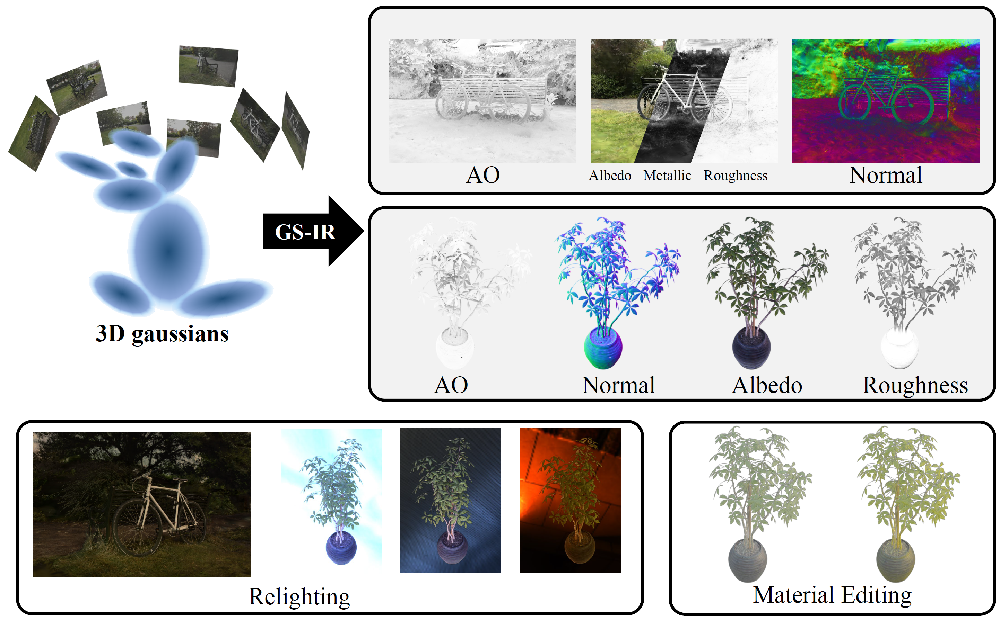

# GS-IR: 3D Gaussian Splatting for Inverse Rendering

#####  
 [Zhihao Liang](https://lzhnb.github.io/), [Qi Zhang](https://qzhang-cv.github.io/), [Ying Feng](https://scholar.google.com.hk/citations?user=PhkrqioAAAAJ&hl=zh-CN), [Ying Shan](https://scholar.google.com/citations?user=4oXBp9UAAAAJ&hl=zh-CN), [Kui Jia](http://kuijia.site/)

  

#### 
[Project Page](https://github.com/lzhnb/GS-IR) | [ArXiv](https://arxiv.org/abs/2311.16473) | [Paper](https://arxiv.org/abs/2311.16473) | [Video]()

 All Code will be released soon... 🏗️ 🚧 🔨

